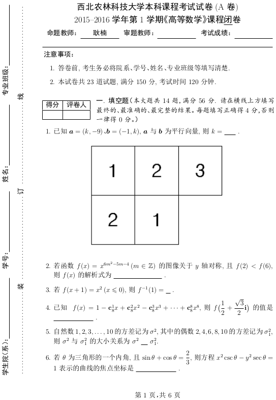

# nwafuExam
西北农林科技大学的试卷LaTeX模板。

### 介绍
---------------------

西北农林科技大学试卷排版LaTeX文档类(模板)，支持学校各类考试试卷排版格式要求。
Happy LaTeXing!

### 安装教程
---------------------

1. 强烈建议安装TexLive 2018或以上的跨平台LaTeX发行版，低版本TexLives可能会有宏包不完整问题。
2. 可以使用任何文本编辑器编辑LaTeX代码。
2. **不支持** [CTeX 套装](http://www.ctex.org/CTeXDownload)。

### 排版样例
---------------------

1. 排版样例

2. 更多样例请查看"./demo"。

###  参与贡献
---------------------
1. 本项目由西北农林科技大学信息工程学院耿楠创建和维护
2. 如果您愿意一同参与工作(不计报酬，免费自由)，请及时与作者联系
